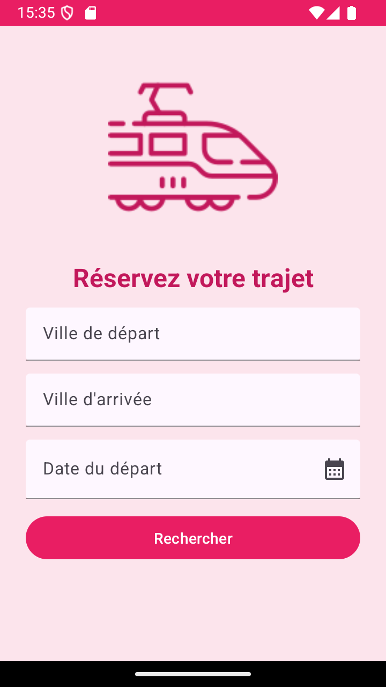
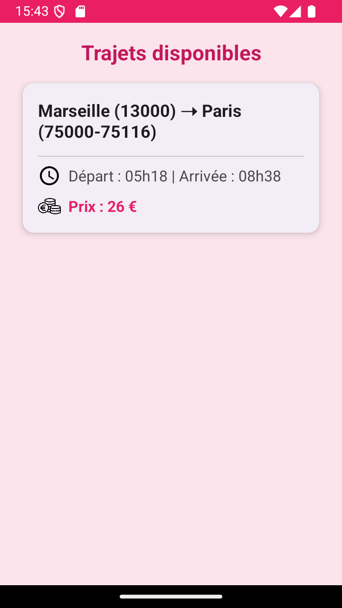
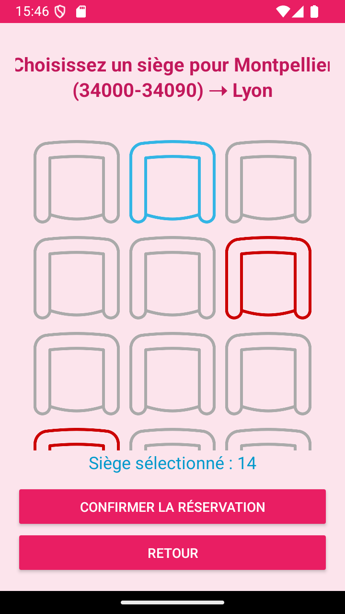
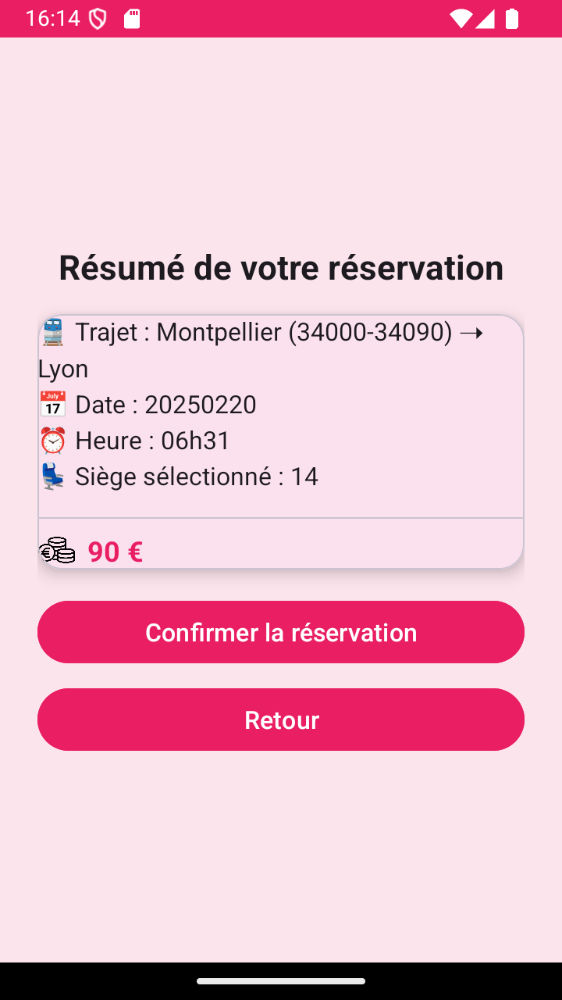
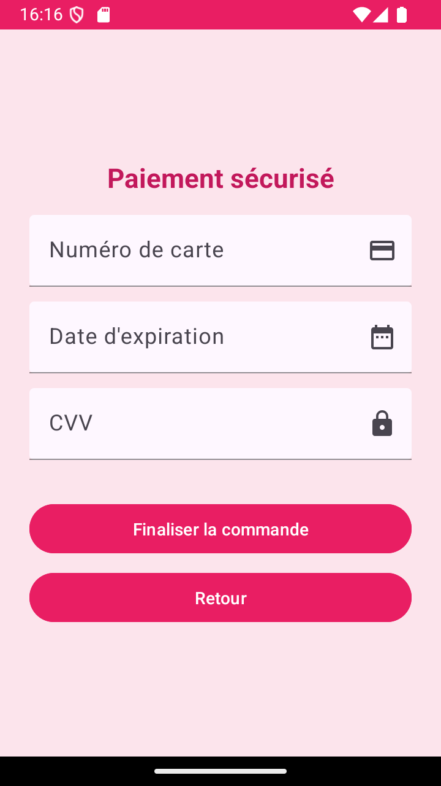
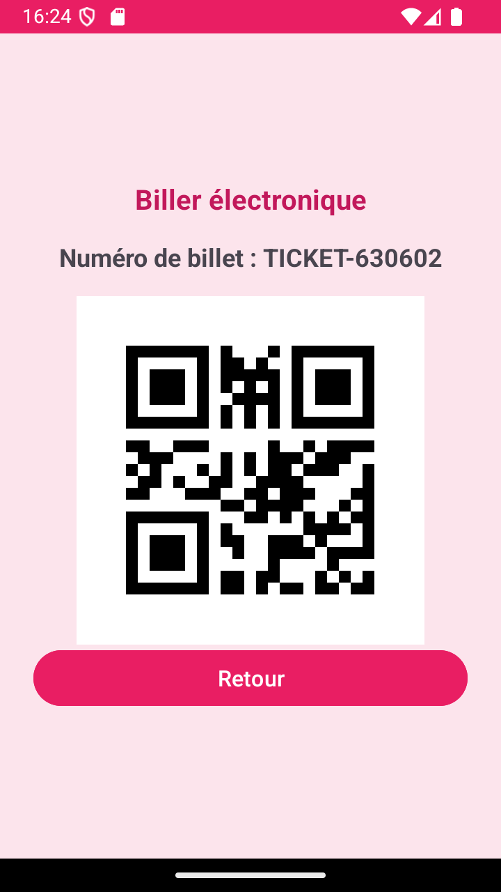

# API_sncf_Train_app

## Introduction

SNCFApp est une application mobile permettant de rechercher des trajets en fonction des villes et des dates entrées par l'utilisateur. Elle permet également de faire l'achat d'un billet et choisir son sièges.

Pour configurer le projet avec Android Studio, suivez les étapes suivantes :

1. Clonez le dépôt :
   ```bash
   git clone [URL du dépôt]
   ```
2. Ouvrez Android Studio et sélectionnez "Open an existing project".
3. Naviguez jusqu'au répertoire du projet cloné et ouvrez-le.
4. Laissez Android Studio télécharger les dépendances et configurer le projet.
5. Une fois la configuration terminée, cliquez sur "Run" pour exécuter l'application sur un émulateur ou un appareil physique.

## Interface UI

### Acceuil de l'app
L'accueil de l’application où l’utilisateur peut rechercher des trajets en train en saisissant la ville de départ, la ville d’arrivée et la date du voyage.
Il envoie ensuite une requête à l’API SNCF pour obtenir les trajets disponibles. L’écran principal permet à l’utilisateur de :
— Saisir la ville de départ et la ville d’arrivée via des champs de texte.
— Sélectionner la date du voyage avec un DatePickerDialog.
— Lancer la recherche en cliquant sur un bouton.



### Page d'affichage des billets 

Page récapitulant les gares et dates choisies sur la partie haute et affichant les différents billets sous forme de MaterialCard avec ville de départ, d'arrivée, durée et prix. 
 
 

 ### Sélection des Sièges
Une fois le trajet sélectionné, l'application vous redirige vers la page de choix des sièges.
Ensuite on peut soit confirmer la réservation, soit retourner a la page d'acceuil.

  

### Récapitulatif du Trajet
Une fois la réservation confirmée, un résumé de toutes les informations saisies sera affiché pour une dérniere confirmation.

  
  
### Paiement du Trajet
Un formulaire de paiement sera affiché pour procéder au paiement par carte.

  

### QR code 
une fois le paiement passe un qr_code est generer automatiquement

  


  
